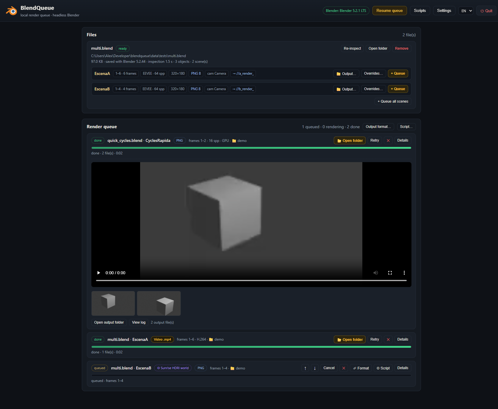

# BlendQueue

**Cola local de renders para Blender.** Cargas tus archivos `.blend`, BlendQueue **inspecciona
cada escena** en headless (rango de frames, motor, samples, cámara, formato y carpeta de salida)
y tú eliges qué se renderiza. Un worker secuencial ejecuta los trabajos con Blender en segundo
plano, muestra el progreso en vivo en el navegador, arma un preview MP4 con ffmpeg y avisa con
una notificación de Windows al terminar cada uno.

Sin nube, sin cuentas, sin telemetría: un servidor FastAPI en `127.0.0.1` y una interfaz
HTML/CSS/JS sin paso de compilación.

*[Read this in English](README.md)*

La interfaz sale en **inglés** por defecto; en la cabecera hay un selector **EN / ES** y la
elección se recuerda en ese navegador.



## Para qué sirve

Renderizar varios `.blend` seguidos suele significar quedarse mirando una consola, o abrir cada
archivo solo para ver su rango de frames y su configuración de salida. BlendQueue te lleva la
cola: lee lo que cada escena tiene configurado de verdad, te deja sobreescribir lo que quieras
(frames, motor, samples, GPU/CPU, resolución, **formato de salida**, carpeta destino) y ejecuta
un trabajo a la vez para que Blender no pelee consigo mismo por la GPU.

## Requisitos

| | |
|---|---|
| Sistema | Windows 10/11 — las notificaciones y «abrir carpeta» usan APIs de Windows |
| Blender | 3.x, 4.x o 5.x (autodetectado: instalador, Steam, `PATH` o `BLENDQUEUE_BLENDER`) |
| Python | 3.10+ (`run.bat` crea el entorno virtual solo) |
| ffmpeg | opcional, en el `PATH` — solo para los previews MP4 |

El núcleo (inspección, cola, render) es Python puro y se portaría a Linux/macOS cambiando tres
cosas específicas de Windows: `os.startfile`, `taskkill` y el notificador de toasts.

## Instalación y uso diario

```bash
git clone https://github.com/alexnovoab90/BlenderQueue.git
```

Doble clic en **`run.bat`**: crea `.venv` (con [uv](https://github.com/astral-sh/uv) si lo
tienes, si no con `pip`), instala las dependencias y abre <http://127.0.0.1:8777>. Si el
servidor ya está corriendo, solo abre el navegador.

Otro puerto:

```bash
.venv\Scripts\python.exe server.py --port 8888 --no-browser
```

Luego, en la interfaz:

1. Agrega archivos (ver abajo) y espera la inspección: aparecen las escenas con sus frames,
   motor, resolución, formato y salida.
2. Encola escenas con los overrides que quieras. Sin overrides se respeta lo guardado en el `.blend`.
3. Sigue la cola en vivo. Al terminar cada trabajo tienes preview (video o frames), botón
   *Abrir carpeta de salida*, log completo y notificación de escritorio.

## Cómo agregar archivos

- **Seleccionar ruta del equipo…** → registra el `.blend` *en su lugar*. Recomendado: conserva
  las texturas con rutas relativas. También puedes registrar una carpeta completa y se agregan
  todos sus `.blend`.
- **Arrastrar y soltar** → copia el archivo a `data/uploads/`. Ojo con proyectos que usan
  texturas relativas: la copia las rompe.

La inspección corre en paralelo con los renders, así que agregar archivos nunca frena la cola.

## Cambiar el formato de salida

Cada escena muestra el formato guardado en el `.blend` (PNG 8, OpenEXR multicapa 32, Video .mp4…).
Puedes sobreescribirlo **por trabajo**, sin tocar nunca el archivo `.blend`:

- **Antes de encolar** — en *Overrides…* de cada escena.
- **Ya encolado** — botón *Formato* de cualquier trabajo en cola, o **Formato de salida…** en la
  cabecera de la cola para aplicar un formato a todos de una vez. Es el caso típico: encolas
  archivos de distintos proyectos y uno venía guardado con otro formato. La cabecera te avisa
  (`formatos mezclados: …`) y con un clic queda todo unificado.

Las opciones disponibles salen de lo que reporta tu Blender: formato, profundidad de color, modo
de color, calidad/compresión, códec EXR, y contenedor + códec de video para FFmpeg. Al cambiar a
un formato de película se escribe un único archivo en vez de una secuencia numerada, y el preview
se adapta (el EXR lineal lo convierte ffmpeg; el EXR multicapa no tiene preview porque ffmpeg no
sabe leerlo).

## Scripts de Python por trabajo

Lo que no cubren los overrides, lo cubre un script: borrar materiales duplicados, cambiar el
mundo por un HDRI, armar un nodo de composición, apagar una colección.

Tienes una biblioteca con nombres (botón **Scripts** en la cabecera) y el script se aplica igual
que el formato: en una escena antes de encolar, en un trabajo ya en cola, o a toda la cola de una
vez. Corre dentro de Blender justo antes del render, *después* de los overrides de la app, así
que puede cambiar cualquier cosa, incluido lo que acaba de poner BlendQueue.

Tu código recibe `bpy`, `sc` (la escena de ese trabajo, resuelta por nombre) y `blend_path`, y
trabaja sobre la copia en memoria de Blender: **el .blend nunca se modifica**. Si lanza una
excepción el trabajo queda en error con la excepción en su línea de error y el traceback completo
en el log — nada de descubrir a las 3 horas que los 500 frames salieron mal. Lo que se ejecutó
exactamente queda guardado en `data/scripts/job_<id>.py`.

Al aplicar un script se guarda una copia en el trabajo, así que editar la biblioteca después no
cambia lo que van a ejecutar los trabajos que ya estaban en cola.

```python
# cambiar el mundo por un HDRI
img = bpy.data.images.load(r"D:\hdri\sunrise_4k.exr", check_existing=True)
world = sc.world or bpy.data.worlds.new("HDRI")
sc.world = world
world.use_nodes = True
nt = world.node_tree
nt.nodes.clear()
env = nt.nodes.new("ShaderNodeTexEnvironment"); env.image = img
bg = nt.nodes.new("ShaderNodeBackground")
out = nt.nodes.new("ShaderNodeOutputWorld")
nt.links.new(env.outputs["Color"], bg.inputs["Color"])
nt.links.new(bg.outputs["Background"], out.inputs["Surface"])
```

## Cómo renderiza (por dentro)

```
blender.exe -b "archivo.blend" -S "Escena" [--python-expr overrides] -o "salida####" -s INICIO -e FIN -a
```

- **Sin override de salida** se usa tal cual la carpeta guardada en el `.blend`.
- **Con override** se escribe `<archivo>_<escena>_####.<ext>` en la carpeta elegida.
- Motor, samples y dispositivo se toman del archivo salvo override por trabajo.
- Los overrides se aplican con un fragmento de Python generado que corre dentro de Blender. Cada
  asignación va protegida: un valor no soportado deja una línea en el log en vez de tumbar el
  render (eso también absorbe el rename `BLENDER_EEVEE` / `BLENDER_EEVEE_NEXT` entre versiones).
- Cancelar mata el proceso de Blender (`taskkill`); reintentar vuelve a encolar; ↑/↓ reordenan.
- Un solo render a la vez: Blender ya satura GPU/CPU.

## Estructura

```
server.py                       servidor FastAPI + API (punto de entrada)
core/config.py                  rutas, detección de Blender, chequeo de versión cacheado
core/store.py                   estado persistente (JSON atómico): archivos, trabajos, ajustes
core/inspector.py               carril de inspección: corre Blender headless por cada .blend
core/worker.py                  worker secuencial: proceso, progreso, previews, notificaciones
core/renderer.py                armado del comando, código de overrides, parseo, ffmpeg
core/formats.py                 catálogo de formatos de salida y validación de overrides
blender_side/inspect_blend.py   corre DENTRO de Blender y reporta escenas y capacidades en JSON
static/i18n.js                  idiomas de la interfaz (inglés en el código + mapa al español)
static/                         interfaz web (sin build)
tests/                          pruebas de humo y generador de .blend de prueba
data/                           estado, logs y scripts por trabajo, uploads, previews (fuera de git)
```

El servidor nunca importa `bpy`: todo lo de Blender ocurre en un subproceso, por eso BlendQueue
funciona con la instalación de Blender que le apuntes.

## Pruebas

Las pruebas de humo llaman a la API HTTP real contra un servidor corriendo y renderizan frames
de verdad. Genera los archivos de prueba una vez:

```bash
blender.exe -b --factory-startup --python tests/make_tests.py -- "%CD%/data/tests"
```

Y con BlendQueue abierto:

```bash
tests\run_smoke.bat quick
```

Modos: `quick` (secuencia EEVEE), `multi` (selección de escena con `-S`), `cycles` (GPU),
`format` (overrides de formato: EXR, video, editar un trabajo en cola, aplicar a toda la cola),
`script` (scripts por trabajo: biblioteca, efecto real en el render, copia congelada, fallo) y
`real "G:/ruta/archivo.blend" [render]` para uno de tus propios archivos.

## Problemas comunes

- **Blender no encontrado** → Ajustes → ruta de `blender.exe`, o define `BLENDQUEUE_BLENDER`.
- **Texturas rosadas / faltan archivos** → agrega el `.blend` *por ruta* en vez de arrastrarlo, o
  empaqueta las texturas. El reporte de inspección cuenta los archivos externos que faltan.
- **Puerto ocupado** → `run.bat` detecta si ya está corriendo y solo abre el navegador.
- **Cerrar la ventana del servidor detiene la cola** → los trabajos en curso quedan marcados como
  interrumpidos y se pueden reintentar. Mejor usa el botón ⏻ de la cabecera.

## Nota de seguridad

BlendQueue es una herramienta local: lista carpetas, abre ventanas del Explorador y lanza Blender.
El servidor escucha solo en `127.0.0.1` y rechaza las peticiones cuyo `Host` u `Origin` no sean
locales, para que ninguna otra página del navegador pueda manejarlo. No lo expongas a la red.

## Licencia

MIT — ver [LICENSE](LICENSE). Se aceptan issues y PRs en
<https://github.com/alexnovoab90/BlenderQueue>.
